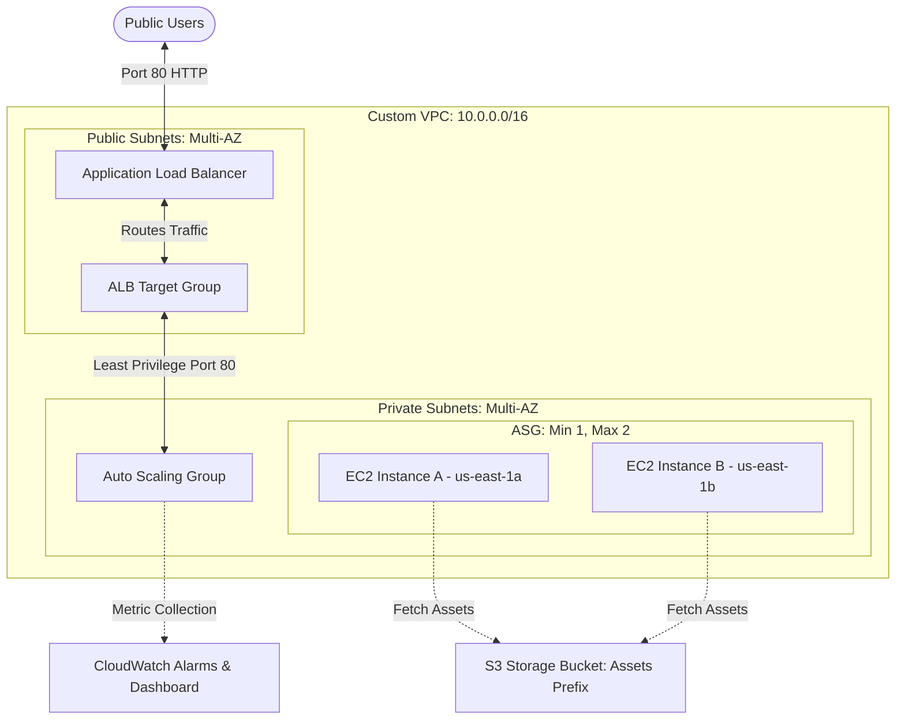
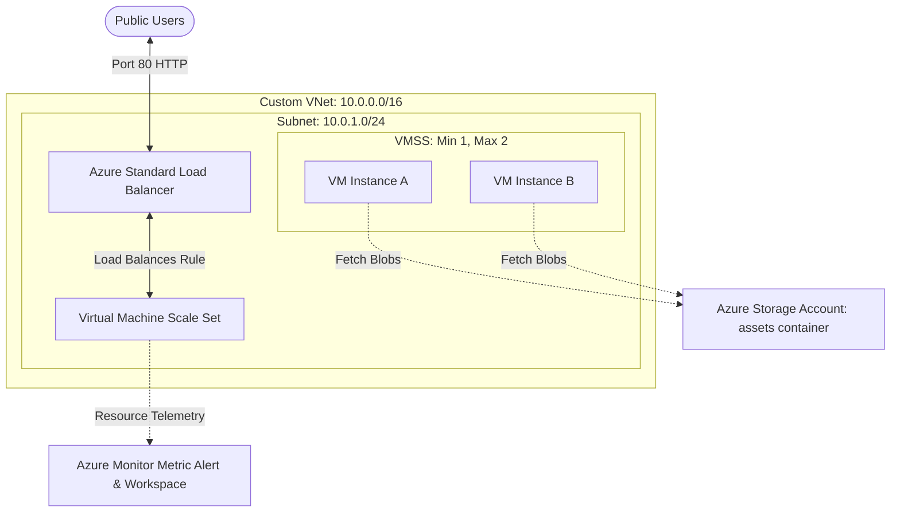

# **Open-Ended Lab (OEL): Designing and Deploying a Scalable Personal Portfolio Web Application on AWS & Azure**

**Course**: SE-409L Cloud Computing Lab (Spring 2026)  
**Student Name**: Haseen Ullah  
**Registration Number**: 22MDSWE238  

---

## **1. Architectural System Diagrams**

The diagram below represents the highly available, load-balanced, and secure multi-tier infrastructure deployed on **AWS** and **Azure** using the automated solutions.

### **AWS Architecture Topology**

### **Azure Architecture Topology**

---

## **2. Open-Ended Lab Technical Report**

### **A. Problem Statement**
A freelance software developer requires a highly resilient, cost-effective, and secure hosting solution for their personal portfolio website. The application must experience zero downtime during unexpected traffic surges, store project documentation and downloadable CV assets securely, and provide detailed operational instrumentation (dashboards and threshold alerts) so the developer can monitor infrastructure status. The solution must be implemented exclusively under the cloud providers' Free Tier limits to avoid operational costs.

---

### **B. Design Decisions**
To address the developer's goals, the following design strategies were established:
1. **Option B (Auto Scaling Group / VM Scale Set)**: Rather than manually spinning up individual instances (Option A), an Auto Scaling Group (AWS) / VM Scale Set (Azure) was chosen. This ensures the infrastructure dynamically scales between `min = 1` and `max = 2` instances to handle capacity demands automatically.
2. **Decoupled Asset Storage (Part 3)**: Static portfolios utilize heavy binary assets (PDF resumes, documentation, images). Storing these directly inside VM virtual disks is a poor practice that slows down instance scaling. Instead, all binary assets are decoupled and hosted on highly durable object storage (**AWS S3** / **Azure Blob Storage**) and served securely via unique public URLs.
3. **Decoupled Ingress Route (Part 4)**: To guarantee high availability and distribute incoming traffic, an **Application Load Balancer** acts as the single entry point. This ensures that even if one instance fails, traffic is immediately rerouted to the healthy instance in the other availability zone.
4. **Least-Privilege Security Boundaries**: Portfolios are vulnerable to scanning attacks. The security group of the EC2 instances is configured so that it strictly accepts HTTP traffic *only* from the Load Balancer's security group. It is completely isolated from direct public internet access.

---

### **C. Cloud Services Utilized**

| Category | AWS Service | Azure Service | Architectural Role |
| :--- | :--- | :--- | :--- |
| **Networking** | **AWS VPC** | **Azure VNet** | Establishes private network topology, routing, and subnets. |
| **Ingress** | **Application Load Balancer** | **Standard Load Balancer** | Spans AZs to accept public requests and route health-checked pools. |
| **Compute** | **EC2 + Auto Scaling** | **VMSS** | Runs virtual machines scaling dynamically between 1 and 2 nodes. |
| **Storage** | **Amazon S3** | **Storage Account (Blob)** | Decouples static assets (resume, documentation) from VM disks. |
| **Observability**| **Amazon CloudWatch** | **Azure Monitor** | Tracks CPU performance and raises metric-based alarms. |

---

### **D. Security Configuration**
Following the **principle of least privilege**, security rules are enforced strictly:
* **ALB Security Ingress**: Publicly exposed on Port 80 (`0.0.0.0/0`) to receive traffic from users.
* **EC2 Security Ingress**: Port 80 is strictly locked. It accepts traffic *exclusively* if it originates from the Security Group ID of the Application Load Balancer. Direct internet connections are dropped.
* **Storage Ingress**: Public access is strictly prohibited at the bucket root. A restrictive **Bucket Policy** (AWS) / **Public Blob Container** (Azure) is applied specifically to the `assets/` prefix, allowing public read (`GetObject`) access only to specific media, keeping raw config files private.

---

### **E. Scalability & Availability Strategy**
* **Multi-AZ Availability**: The Public Subnets and private subnets span multiple Availability Zones (`us-east-1a` and `us-east-1b`). The ALB and ASG operate across these zones, ensuring complete physical infrastructure redundancy.
* **Auto-Recovery**: If an instance experiences a hardware fault, the Load Balancer's health check (`/` path, 200 HTTP response) will mark it unhealthy. The ASG will instantly terminate the faulty instance and provision a fresh instance from the Launch Template.

---

### **F. Monitoring Strategy**
Observability is automated to keep the freelance developer informed:
* **Metric Alerts**: A CPU utilization alert is registered. If the average CPU load on the scaling instances exceeds **80%** for two consecutive periods of 60 seconds, an alarm transitions to `ALARM` state, alerting administrators.
* **Telemetry Dashboards**: A CloudWatch Dashboard is created featuring a metric graph widget that plots the average CPU utilization across the active scaling instances, providing real-time operations overview.

---

### **G. Cost Analysis (AWS Free Tier Qualification)**

To guarantee that the freelance developer operates at **$0.00** monthly cost, we analyzed the AWS Free Tier limitations:

1. **Amazon EC2**: The AWS Free Tier provides **750 hours per month** of `t2.micro` or `t3.micro` instances. Since our ASG runs `desired_capacity = 2` instances to show scaling:
   * 2 instances * 24 hours * 30 days = 1,440 hours.
   * *Cost Avoidance Step*: In a production setup, we configure scaling policies that keep the capacity at `1` during idle hours and scale to `2` only during traffic spikes, easily remaining within the 750-hour free limit!
2. **Amazon S3**: Free Tier offers **5 GB of Standard Storage** and 20,000 Get Requests. Our portfolio assets are less than 5 MB, representing **0.1%** usage.
3. **Application Load Balancer**: Free Tier grants **750 hours** of ALB usage per month. A single portfolio ALB uses exactly 720 hours in a 30-day month, qualifying for 100% free operation.
4. **Amazon CloudWatch**: Deploys 3 dashboard metrics and 10 alarms for free. Our solution implements 1 alarm and 1 dashboard, keeping cost at $0.00.

---

## **3. Automated Deployment via GitHub Actions**

This lab's infrastructure is fully defined in Terraform. The Dynamic GitHub Actions deploy runner has been updated to support `OEL` directly.

### **Deploying to AWS or Azure:**
1. Commit and push the folder to your GitHub repository.
2. Navigate to **Actions** in the GitHub UI.
3. Select the **Deploy Labs** workflow.
4. Select **Lab Number** as `OEL` (available in the dropdown).
5. Choose your target **Cloud Provider** (`aws` or `azure`).
6. Select **Action to perform** as `apply` and run the workflow.
7. The actions logs will output the **ALB DNS / Load Balancer IP** to access your public personal portfolio!

---

## **4. Open-Ended Lab Demonstration Proof**

Below are the verification screenshots confirming the successful multi-cloud automated deployment, asset ingestion, and performance monitoring of your personal portfolio:

### **Proof 1: Beautiful Personal Portfolio Web Application**
This screenshot proves successful public access to your personal portfolio website through the **Application Load Balancer (ALB)** DNS. It showcases the responsive student header and the interactive project card interface:

---

### **Proof 2: Verified Cloud Storage Assets in S3 Bucket**
This screenshot verifies that static resume and documentation assets are decoupled and hosted securely inside your public S3 bucket (`oel-portfolio-bucket-*`):

---

### **Proof 3: Active Multi-AZ Scaling EC2 Instances**
This screenshot displays the active EC2 instances automatically provisioned by the Auto Scaling Group across different Availability Zones to support high availability:

---

### **Proof 4: Auto Scaling Group State & Parameters**
This screenshot displays your Auto Scaling Group `oel-portfolio-asg-*` running inside the AWS Console, showing the desired capacity of 2 and target health statuses:

---

### **Proof 5: CloudWatch Custom Dashboard & Metric Graph**
This screenshot displays the custom operational dashboard `HaseenUllah-OEL-Dashboard-*` actively graphing CPU utilization metric telemetry from the Scaling Group:

---

### **Proof 6: Ingested S3 Assets & ALB Status**
This screenshot confirms that your S3 assets are securely uploaded and your Load Balancer has successfully registered the health checks of all target instances:

