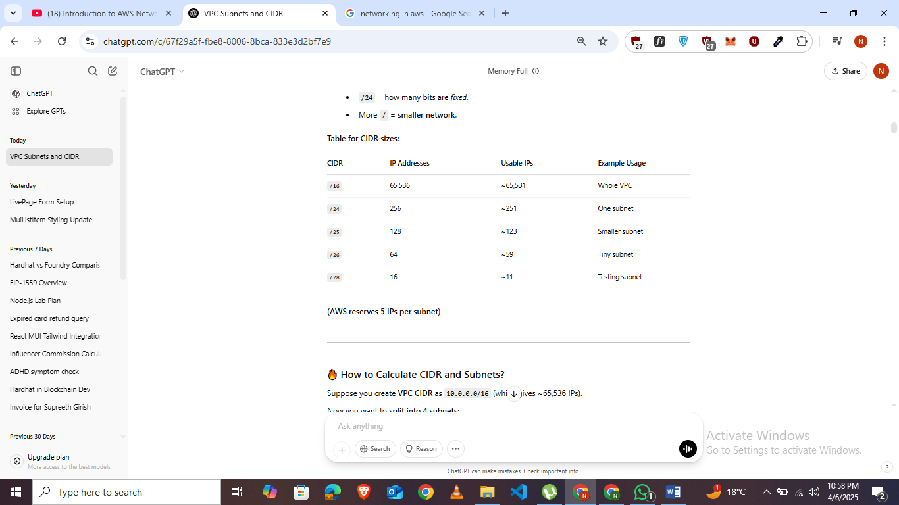
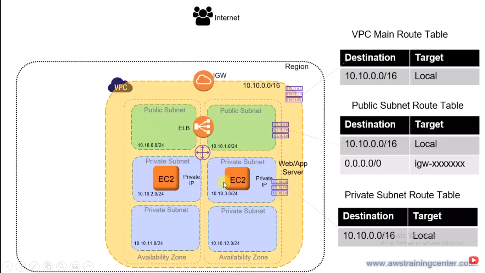
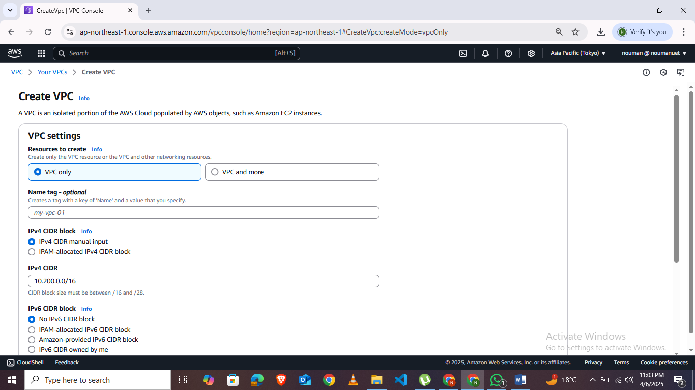
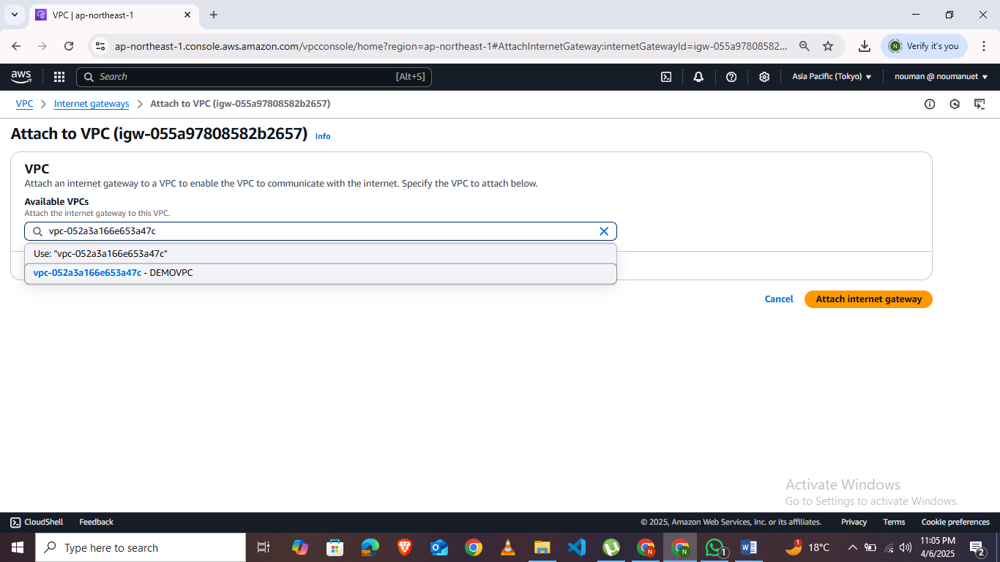
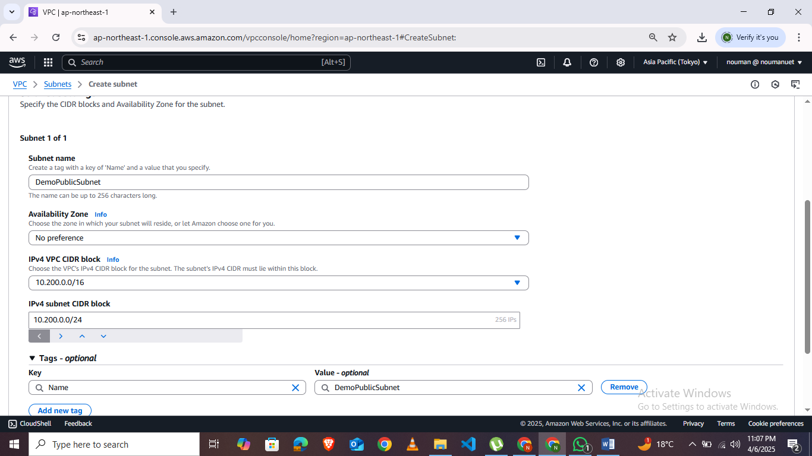
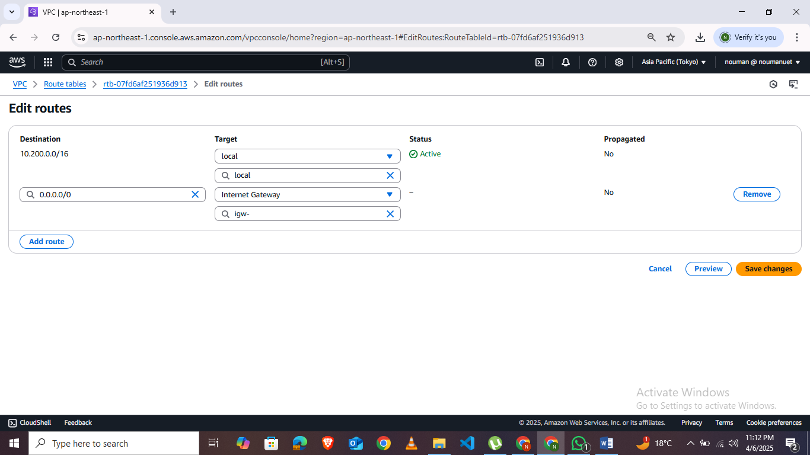
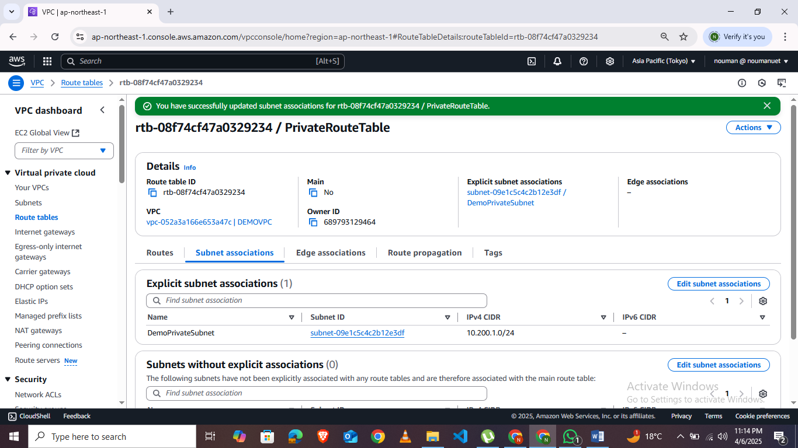

# **Lab 7: Networking in AWS** 

AWS networking enables you to create secure, scalable, and reliable
networks in the cloud, offering services like Amazon VPC for isolated
networks, Direct Connect for dedicated connections, and CloudFront for
content delivery. 

**[Fundamental Networking Services:]{.underline}**

- **Amazon Virtual Private Cloud (VPC):**

A logically isolated section of the AWS Cloud where you can launch AWS
resources in a virtual network environment, giving you control over IP
addressing, subnets, and gateways. Inside the VPC, you can create
servers, databases, and other resources, and control who can access
them.

- **Subnets:**

A range of IP addresses within your VPC, allowing you to segment your
network into public and private subnets. **Subnets** are **smaller
networks** inside your **VPC**. Imagine your VPC is a building ---
**subnets** are like **rooms** inside the building.

- **Security Groups:**

Virtual firewalls that control inbound and outbound traffic for your EC2
instances. 

- **NAT Gateway:**

Allows EC2 instances in private subnets to access the internet without
exposing them directly. 

- **CIDR** (Classless Inter-Domain Routing)**:**

CIDR just **describes an IP range in the format** IP_address/Prefix e.g
10.0.0.0/24 .

{width="4.3747812773403325in"
height="1.7328674540682414in"}

- **Elastic Load Balancing (ELB):**

Distributes incoming application traffic across multiple targets, such
as EC2 instances, to ensure high availability and scalability. 

- **Route Tables:**

Determine how traffic is routed within your VPC. 

- **Internet Gateway:**

Allows VPCs to communicate with the public internet. 

**[AWS VPC Overview:]{.underline}**

{width="6.5in" height="3.654166666666667in"}

**[Creating VPC:]{.underline}**

1.  Go To VPC dashboard and click on create a VPC.

2.  Manually Enter a CIDR in ipv4 and create VPC.

{width="6.5in" height="3.654166666666667in"}

3.  Associate VPC with internet gateway by creating an Internet gateway
    and attach it to your VPC. {width="6.5in"
    height="3.654166666666667in"}

4.  Now Create Subnets . We will create private and public subnets.

> {width="6.5in"
> height="3.654166666666667in"}

Repeat the same steps for private Subnet. Remember not to assign same
subnet CIDR .

5.  Now Assign Route table to Public subnet by creating a subnet and in
    routes table add 0.0.0.0/0 in routes of the route table . Associate
    it with the public subnet. {width="6.5in"
    height="3.654166666666667in"}

6.  Don't add any routes for private route table .Only associate with
    private subnet. {width="6.5in"
    height="3.654166666666667in"}

**[LAB TASKS:]{.underline}**

1.  Create a custom VPC by your Name and Roll Number.

2.  Create public and private subnets in it.

3.  Attach internet gateway to it.

4.  Attack route tables to the public and private subnets.
