# **Lab 13: CI/CD with AWS**

Continuous Integration and Continuous Deployment (CI/CD) is a modern software engineering practice where code changes are automatically integrated, built, tested, and deployed to your cloud environment with minimal manual intervention. 

AWS offers a robust suite of developer services that can be combined to create an end-to-end automated deployment pipeline.

---

## **1. AWS Services for CI/CD**

To build an automated pipeline, we orchestrate several AWS developer services:

| Service | Category | Description |
| :--- | :--- | :--- |
| **AWS CodePipeline** | **Orchestration** | The workflow engine that automates the steps from source code push to production release. |
| **AWS CodeCommit** | **Source Control** | A secure, highly scalable, managed private Git service. *(Note: CodeCommit is unavailable to new AWS accounts; GitHub is used as the primary alternative).* |
| **AWS CodeBuild** | **Build & Test** | A fully managed continuous integration service that compiles source code, runs tests, and produces deployable software packages. |
| **AWS CodeDeploy** | **Deployment** | Automates software deployments to compute services like Amazon EC2, AWS Fargate, AWS Lambda, or on-premises servers. |

---

## **2. Core Configuration Files**

An automated pipeline relies on two critical configuration files placed in the root directory of your application repository.

### **A. `buildspec.yaml` (Used by AWS CodeBuild)**
This file instructs AWS CodeBuild on **how to build your application** (e.g., installing dependencies, running builds, running tests, and preparing outputs).

* **Purpose:**
  * Defines the build environment runtime and command execution phases.
  * Specifies which output files should be packaged as **artifacts** for deployment.

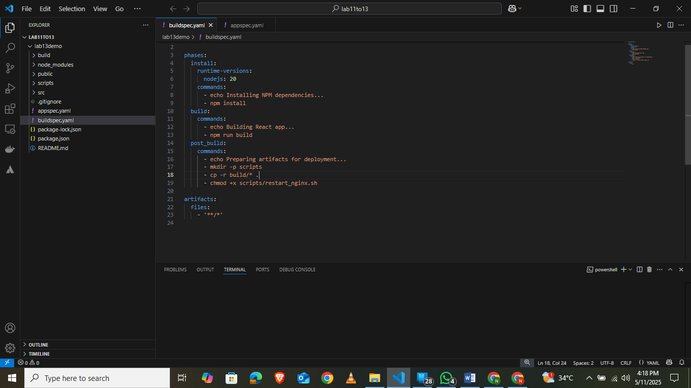

### **B. `appspec.yaml` (Used by AWS CodeDeploy)**
This file instructs AWS CodeDeploy on **how to deploy files** and which custom scripts to execute at different phases of the deployment lifecycle.

* **Purpose:**
  * Specifies the destination path for application files on the EC2 instance.
  * Defines **lifecycle hooks** (e.g., `BeforeInstall`, `AfterInstall`, `ApplicationStart`) to automate tasks like installing server dependencies, managing permissions, or restarting services.

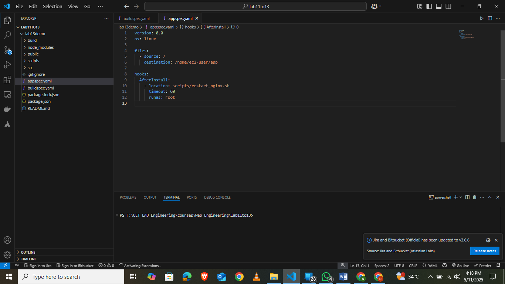

> [!NOTE]
> Within the application files, a custom deployment script (typically under a `scripts/` directory) is executed to restart the Nginx web server dynamically once the files are transferred.
>
> 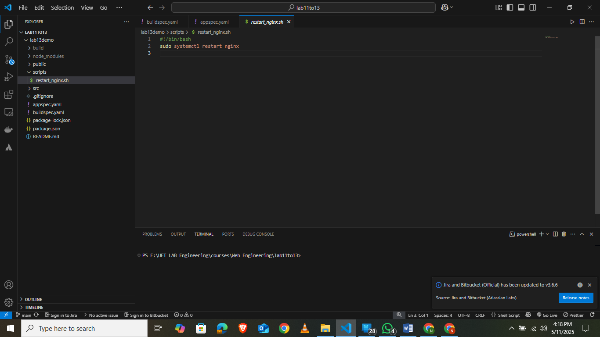

---

## **3. Step-by-Step CI/CD Implementation**

### **Step 1: Create IAM Service Roles**
Before building the pipeline, you must provision secure Identity and Access Management (IAM) roles allowing AWS services to interact with each other.

1. **IAM Role for CodeBuild:** Grants CodeBuild permission to write logs to Amazon CloudWatch and read/write to the Amazon S3 artifact bucket.
   
   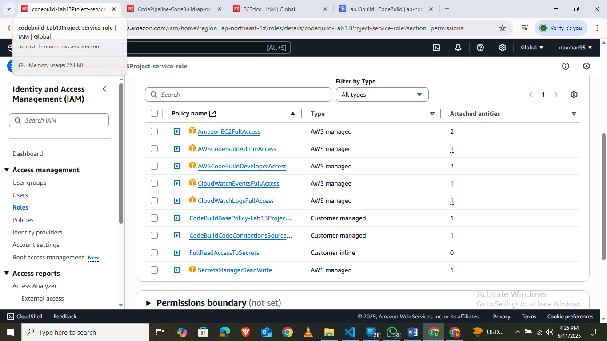

2. **IAM Role for CodePipeline:** Grants CodePipeline permission to coordinate CodeBuild, CodeDeploy, and S3 resources.
   
   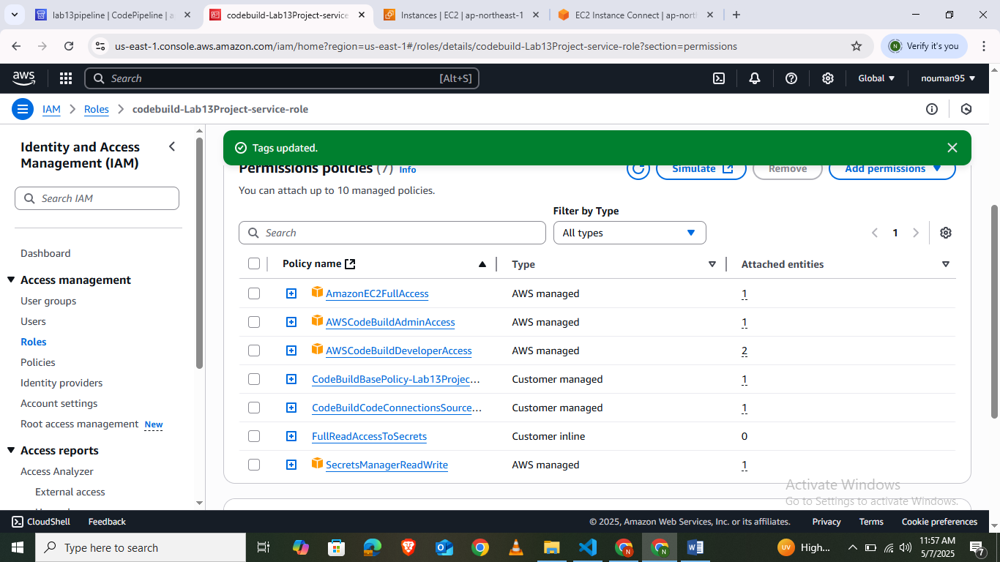

3. **IAM Role for EC2 Instance Profile:** Grants the EC2 instance permission to fetch deployment packages from S3 and interact with the CodeDeploy service.
   
   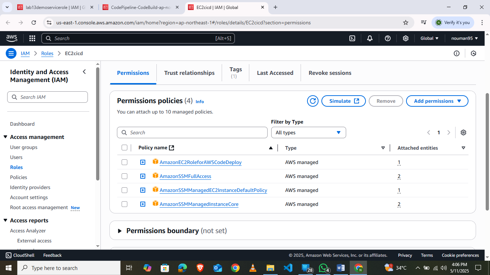

---

### **Step 2: Launch and Configure the EC2 Instance**
Launch an EC2 instance with your custom **EC2 Instance Profile Role** attached. 

> [!IMPORTANT]
> **Assign a unique Tag** (e.g., `Name = Lab13-React-App-EC2`) to your EC2 instance. CodeDeploy uses this tag to identify the target host.

Connect to your EC2 instance via SSH and run the following commands to install the **CodeDeploy Agent** and **Nginx**:

```bash
# 1. Update system packages
sudo yum update -y

# 2. Install Ruby and wget (required for CodeDeploy agent installation)
sudo yum install ruby wget -y

# 3. Download the CodeDeploy agent installer (adjust region as necessary)
cd /home/ec2-user
wget https://aws-codedeploy-us-east-1.s3.amazonaws.com/latest/install

# 4. Set execution permissions and install the agent
chmod +x ./install
sudo ./install auto

# 5. Start and verify the CodeDeploy service
sudo service codedeploy-agent start
sudo service codedeploy-agent status

# 6. Install and configure Nginx
sudo yum install nginx -y
sudo systemctl start nginx
sudo systemctl enable nginx
```

Edit the Nginx configuration file (`sudo nano /etc/nginx/nginx.conf`) to serve the deployed index files:

```nginx
server {
    listen       80;
    server_name  _;
    root         /home/ec2-user;
    index        index.html;

    location / {
        try_files $uri /index.html;
    }
}
```

---

### **Step 3: Set Up AWS CodeDeploy**

1. **Create a CodeDeploy Application:** Navigate to the CodeDeploy console, create a new application, and select the **EC2/On-premises** compute platform.

   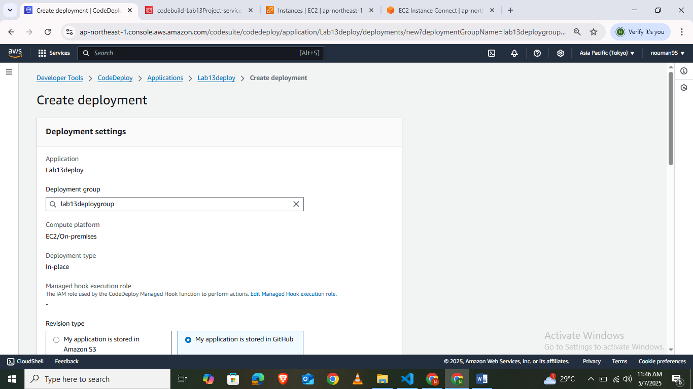

2. **Create a Deployment Group:**
   * Select your **CodeDeploy Service Role**.
   * Choose **In-place** deployment type.
   * Target your instance by entering the tag key-value pair (`Name = Lab13-React-App-EC2`) configured during EC2 creation.
   * Disable Load Balancing (for lab purposes) and save.

   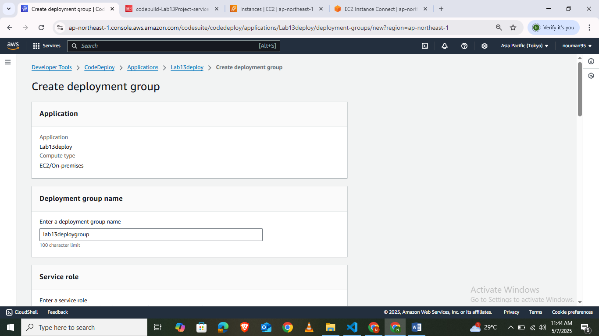
   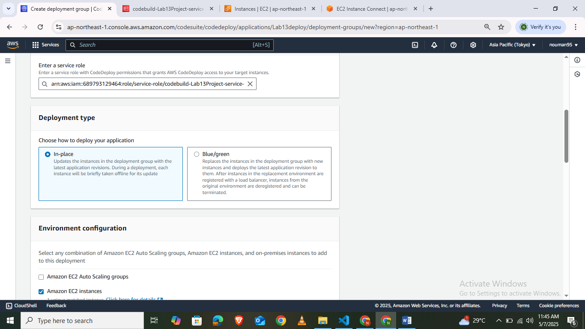
   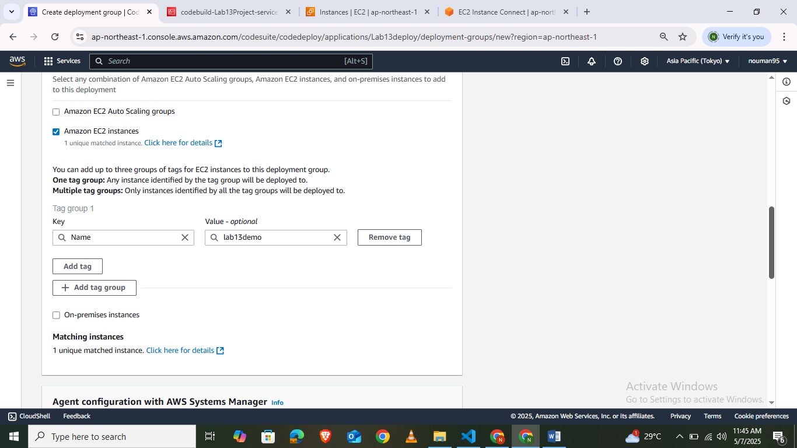
   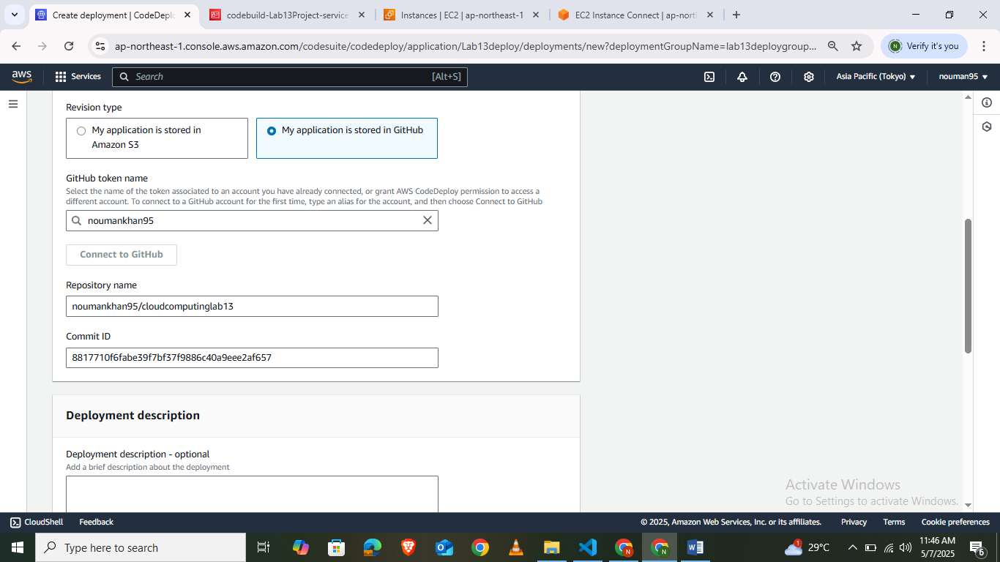

---

### **Step 4: Create AWS CodePipeline**

Create a pipeline in CodePipeline to automate your deployment cycle:

1. **Pipeline Settings:** Give your pipeline a descriptive name and select your custom **CodePipeline Service Role**.
   
   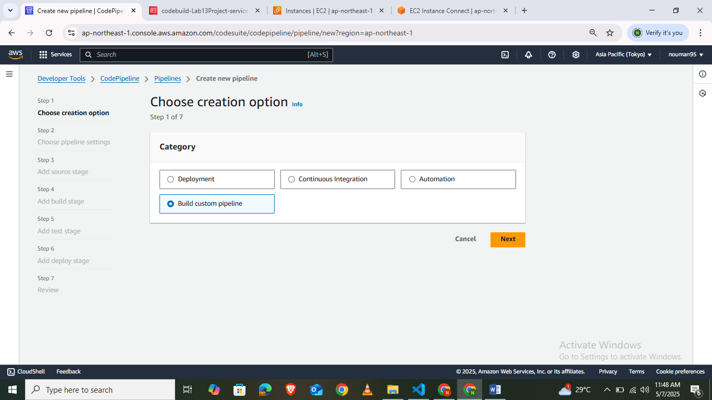

2. **Add Source Stage:** Link the source to your version control repository (e.g., GitHub via AWS CodeStar Connection or Amazon S3 Bucket).
   
   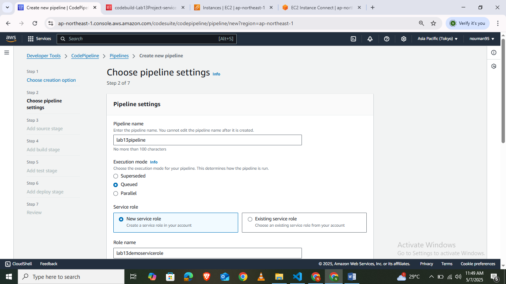

3. **Add Build Stage:** Select **AWS CodeBuild** as the build provider, select your region, and choose or create your CodeBuild project.
   
   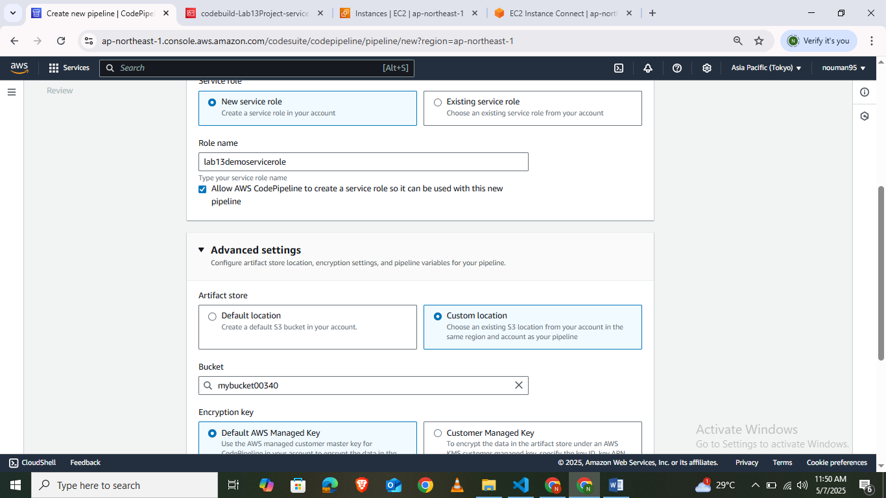
   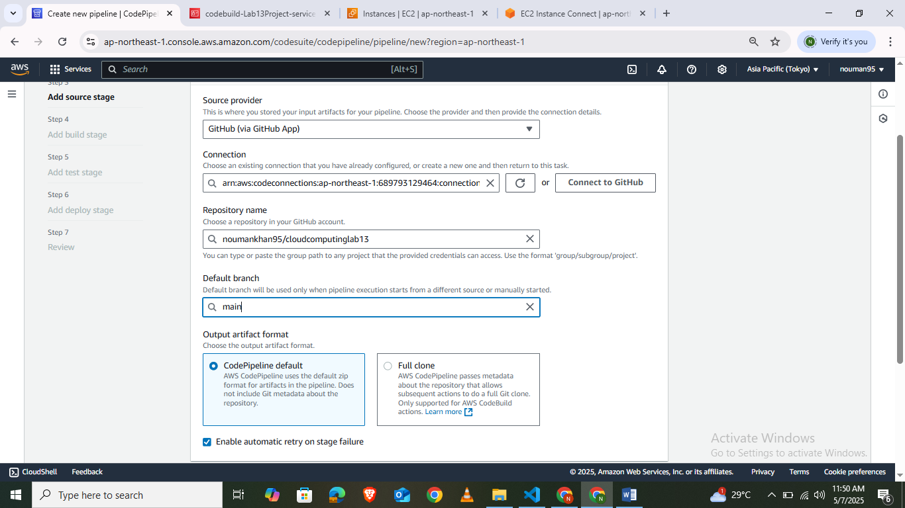

4. **Add Deploy Stage:** Select **AWS CodeDeploy** as the deployment provider, choose the Application Name, and select the Deployment Group.
   
   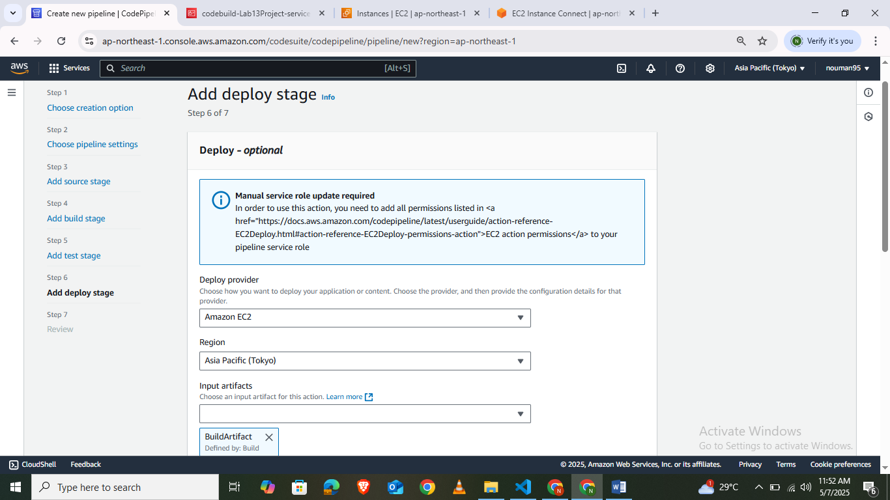

5. **Review and Create:** Review your pipeline configuration and click **Create pipeline**. CodePipeline will trigger the first execution automatically!

   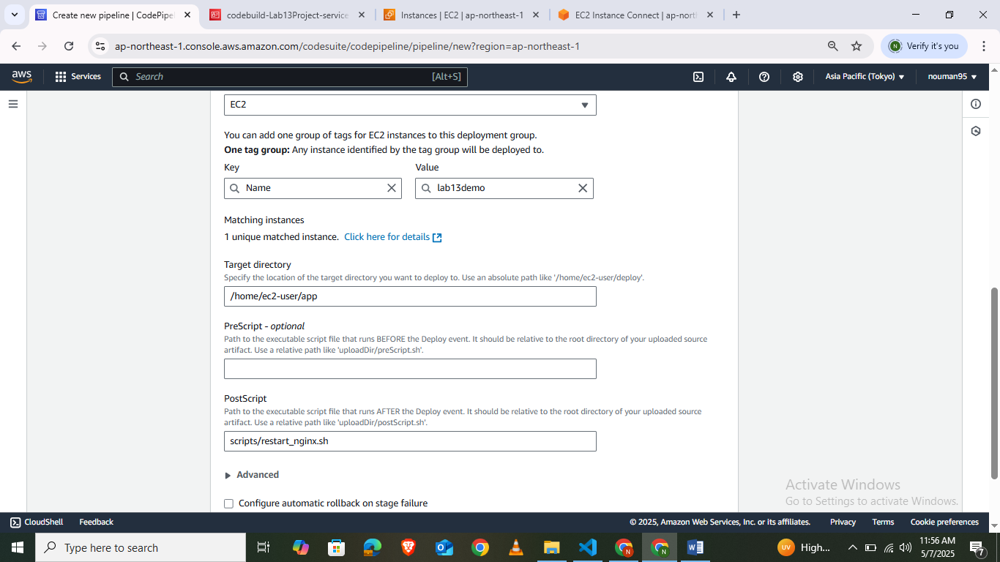
   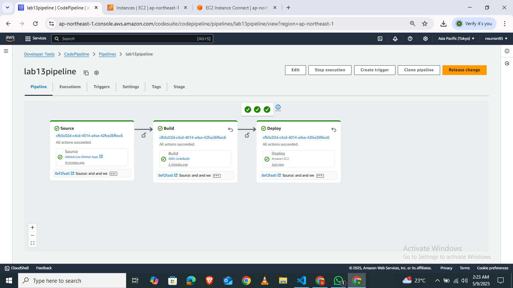

---

## **4. Lab Task**

> [!IMPORTANT]
> **Lab Deliverables:**
> Set up an automated **AWS CodePipeline** for a web application. The pipeline must:
> 1. Trigger automatically upon code changes in the source repository.
> 2. Compile and package files using **AWS CodeBuild**.
> 3. Automatically deploy the updated web page to your Amazon EC2 instance using **AWS CodeDeploy**.
> 4. Serve the updated application over port 80 using **Nginx**.
