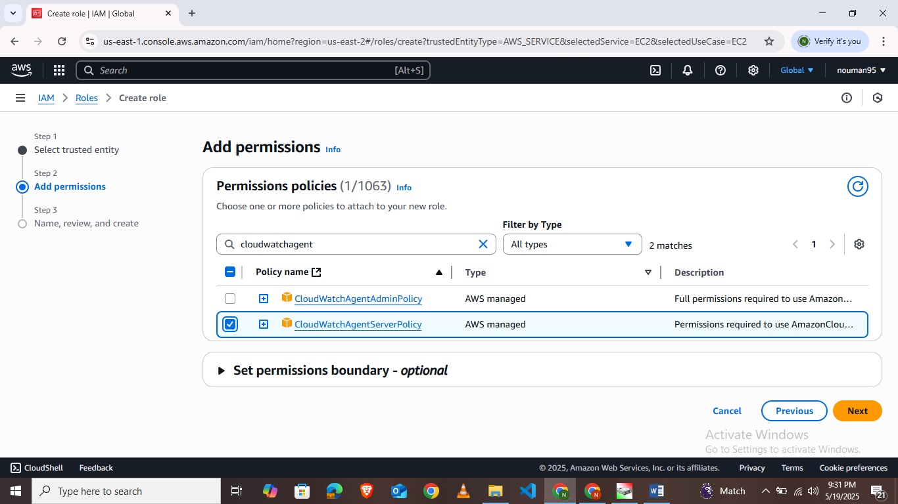
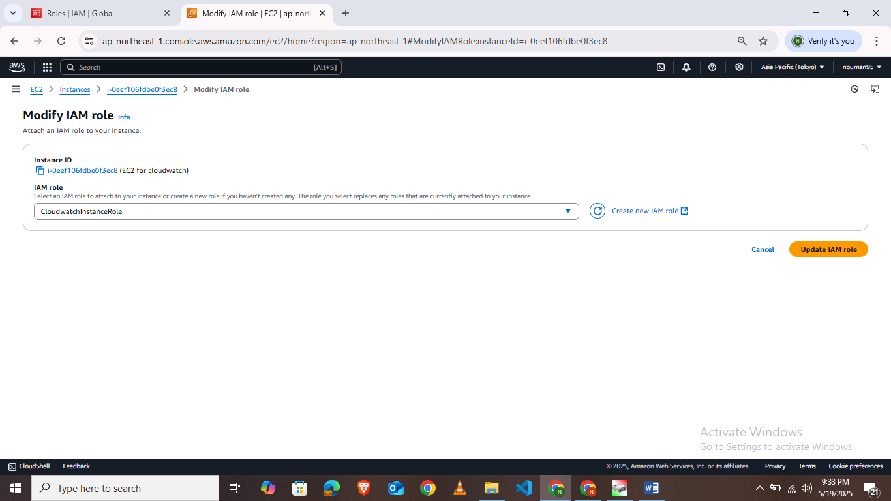
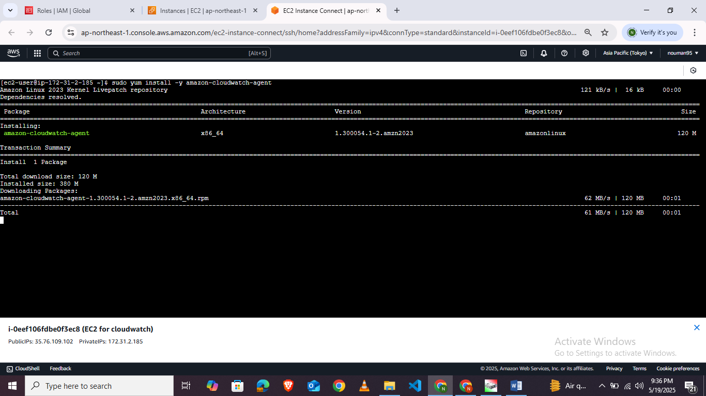
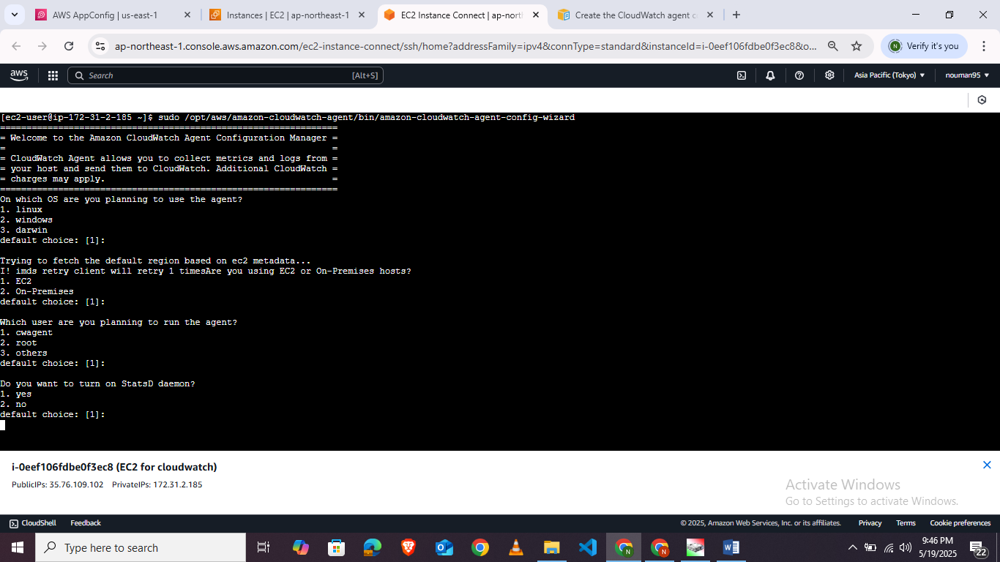
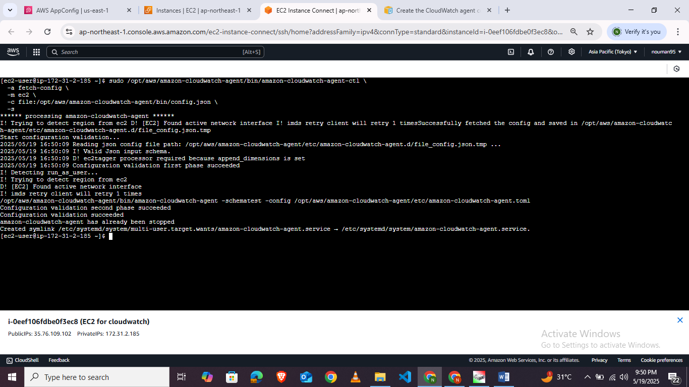
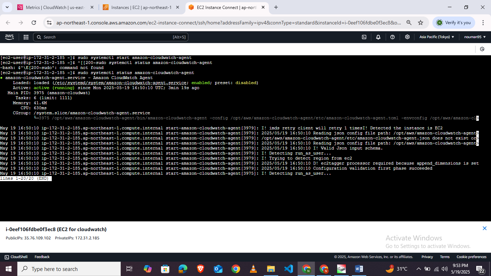
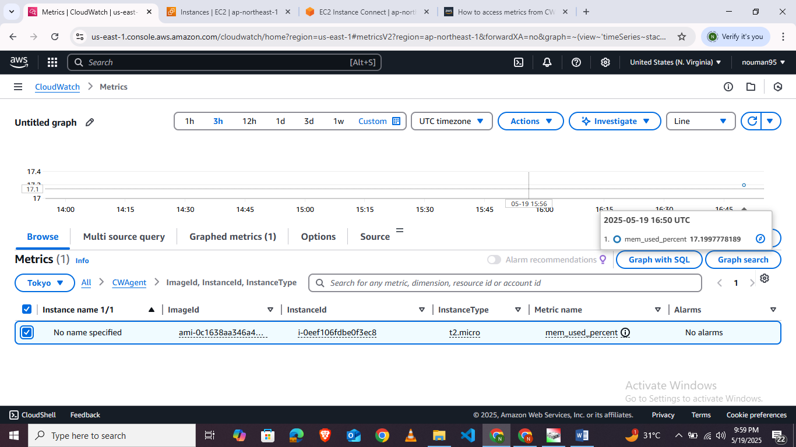
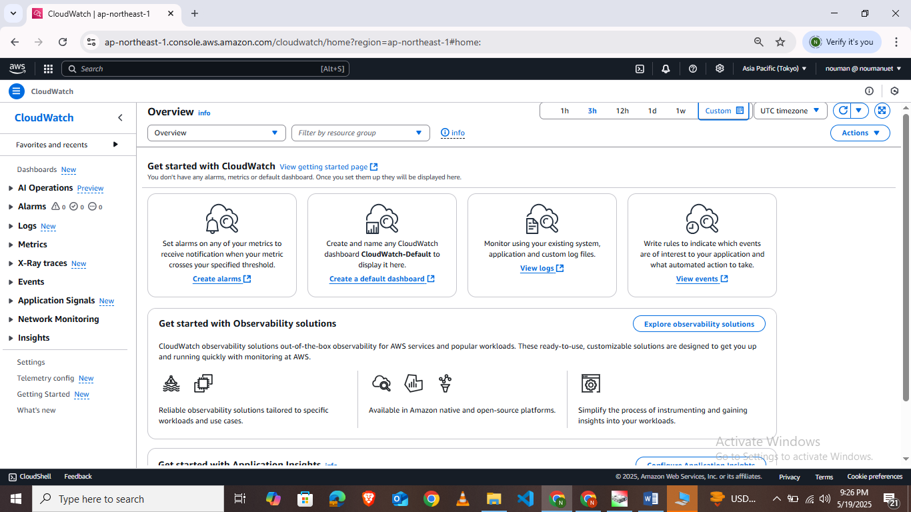

# **Lab 14: AWS Cloudwatch & Azure Monitor (Cloud Monitoring & Observability)**

Monitoring and observability are essential pillars of modern cloud architecture. They allow engineering teams to track the real-time health, resource utilization, and operational performance of active workloads, while dynamically responding to system anomalies or application failures.

---

## **1. Cloud Monitoring Services: AWS vs. Azure**

To establish a comprehensive monitoring system, cloud providers collect time-series resource metrics (e.g., CPU load, memory usage, and disk access) alongside raw application/system logs.

| Concept / Resource | AWS Observation Stack | Azure Observation Stack |
| :--- | :--- | :--- |
| **Observability Center** | **Amazon CloudWatch** (central hub for metrics, logs, events, and alarms) | **Azure Monitor** (integrated workspace for logs, metrics, insights, and alerts) |
| **Data Repository** | **CloudWatch Log Groups** (stores log streams from different sources) | **Log Analytics Workspace** (central SQL-queriable repository for all log tables) |
| **Virtual Machine Agent**| **CloudWatch Agent** (collects system-level metrics and custom files) | **Azure Monitor Agent (AMA)** (modern agent routing metrics/syslog via DCRs) |
| **Access Control** | **IAM Role** with `CloudWatchAgentServerPolicy` attached to EC2 | **System-Assigned Managed Identity** or Resource Group level RBAC |
| **Ingress Rules** | **Agent Config File** (a JSON file listing metrics/log paths to forward) | **Data Collection Rule (DCR)** (Azure resource defining what metrics/logs to route) |

---

## **2. Standard Flow: Attaching CloudWatch to an EC2 Instance**

The manual flow for enabling comprehensive system monitoring on a Linux EC2 instance consists of the following steps:

### **Step 1: Create & Attach an IAM Service Role**
Before installing the agent, you must provision an IAM role containing the AWS-managed policy `CloudWatchAgentServerPolicy` and attach it to your EC2 instance. This grants the host permission to write metrics and log streams directly to your CloudWatch account.




---

### **Step 2: Install the CloudWatch Agent**
Connect to your EC2 instance via SSH or Systems Manager Session Manager, and run the system command to install the CloudWatch Agent package:

```bash
# For Amazon Linux 2023:
sudo dnf install amazon-cloudwatch-agent -y
```



---

### **Step 3: Run the Agent Configuration Wizard**
The agent relies on a JSON configuration file to know which files to monitor and which metrics to ingest. Run the interactive wizard to generate this configuration:

```bash
sudo /opt/aws/amazon-cloudwatch-agent/bin/amazon-cloudwatch-agent-config-wizard
```

During the wizard setup, specify:
1. That the agent will run on an EC2 instance.
2. The log files to collect (e.g., `/var/log/custom-app/app.log`).
3. The custom Log Group name (`lab14-ec2-custom-logs`) and Stream name (`custom-app-stream`).




---

### **Step 4: Start and Verify the Agent**
Start the agent using the wizard-generated config file:

```bash
sudo /opt/aws/amazon-cloudwatch-agent/bin/amazon-cloudwatch-agent-ctl -a fetch-config -m ec2 -c file:/opt/aws/amazon-cloudwatch-agent/bin/config.json -s
```

Verify that the agent service is active:

```bash
sudo systemctl status amazon-cloudwatch-agent
```



---

### **Step 5: View Metrics & Logs in the CloudWatch Console**
Navigate to **Metrics** or **Log Groups** inside the Amazon CloudWatch Console to view system metrics under the `CWAgent` namespace, or review the custom app logs stream in real-time.




---

## **3. Automated Infrastructure Setup**

To eliminate manual overhead, this lab contains a fully automated Terraform implementation for both AWS and Azure. These setups automatically deploy the VM, install the respective monitoring agents, configure log-producing background services, and set up the metric ingestion channels.

### **A. AWS Architecture (`aws/main.tf`)**
* **IAM Configuration**: Automatically creates a role with `CloudWatchAgentServerPolicy` and `AmazonSSMManagedInstanceCore` attached, wrapping it in an Instance Profile for the EC2.
* **EC2 User Data Automation**:
  1. Installs `amazon-cloudwatch-agent` non-interactively.
  2. Provisions a background log-generator service (`/usr/local/bin/log-generator.sh`) that writes CPU load average and free memory information to `/var/log/custom-app/app.log` every 10 seconds.
  3. Pre-configures the CloudWatch JSON configuration file with collection rules for **CPU (active, user, system)**, **Memory (used, available)**, **Disk space usage**, and the **custom log file**.
  4. Automatically registers and boots the CloudWatch Agent with the config file.

### **B. Azure Architecture (`azure/main.tf`)**
* **Log Analytics Workspace**: Provisions a centralized workspace (`lab14-law-*`) configured for 30-day data retention.
* **Virtual Machine**: Deploys an Ubuntu 22.04 LTS VM.
  * User Data deploys the same background log-generator service, writing heartbeat details to `/var/log/custom-app/app.log` and forwarding log events to Syslog using `logger -p user.info -t custom-app`.
* **Azure Monitor Agent (AMA)**: Deploys the modern Linux Monitor extension (`Microsoft.Azure.Monitor.AzureMonitorLinuxAgent`) directly onto the Virtual Machine.
* **Data Collection Rule (DCR)**:
  * Establishes a DCR routing **Performance Counters** (Processor % Time, Available Memory, Used Memory, Disk % Free Space) and **Syslog events (user facility, Info+ level)** directly into the Log Analytics Workspace.
  * Links the Virtual Machine to the DCR via a DCR Association (DCRA) resource.

---

## **4. How to Deploy via GitHub Actions**

Because both implementations are fully automated in Terraform and utilize the `s3` state backend, you can deploy them using your repository's existing **Deploy Labs** GitHub Actions workflow:

1. **Navigate to GitHub Actions**: Open your GitHub repository and click on the **Actions** tab.
2. **Select Deploy Labs Workflow**: Click on the **Deploy Labs** workflow in the left sidebar.
3. **Run Workflow**:
   * Click the **Run workflow** dropdown.
   * Set **Lab Number** to `14`.
   * Select your target **Cloud Provider** (`aws` or `azure`).
   * Choose **Action to perform** as `apply`.
   * Click **Run workflow**!

Once the workflow finishes successfully, it will output the public IP of the deployed instance. You can log into your AWS/Azure Console and observe the real-time resource telemetry and live log ingestion!

---

## **5. Lab Task Recap**

> [!IMPORTANT]
> **Lab Deliverables:**
> Set up automated VM telemetry and log forwarding. Your deployed architecture must:
> 1. Auto-provision a Virtual Machine in AWS or Azure using Terraform.
> 2. Automatically install the monitoring agent on the instance.
> 3. Implement a log-generator background service producing periodic custom logs.
> 4. Stream system-level metrics (CPU, Memory, Disk) and custom log heartbeats directly to your cloud observability suite (**CloudWatch Logs / Log Analytics**).
